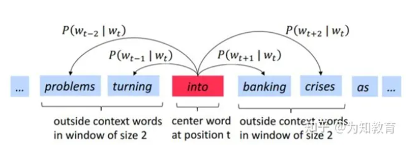
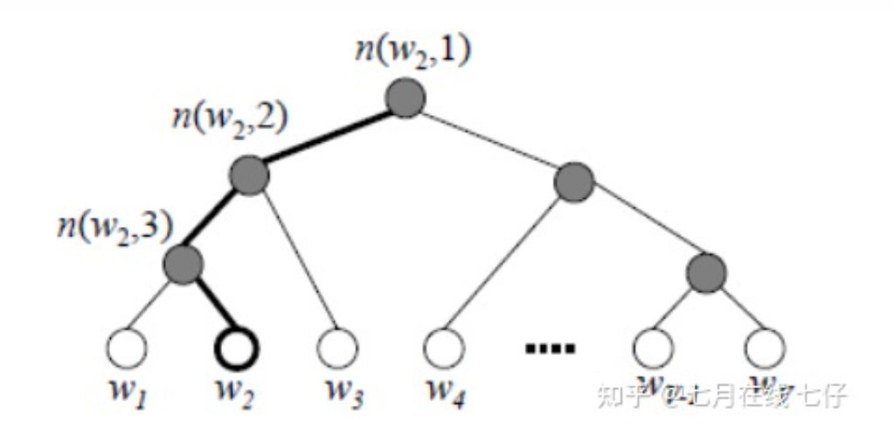

# word2Vec

	神经网络一般将词表中的词语通过**序号化—&gt;embedding**的形式，输出一个低维度的向量表示这个词语，然后利用某个任务的损失函数通过反向传播的方法不断优化这个低纬度向量（词向量），使其能够更准确的表示这个词语。word2vec就是这样一种训练词向量的无监督学习方法（静态词向量的表示方法），它通过词与词之间的上下文关系来相互预测，达到训练好词向量的目的。

	**相较于onehot编码的优点**：**可以降低维度。**一般会使用one-hot编码，而这种编码额维度等于词汇量，所以在词汇量增大到上万维的时候，会发生维度灾难，其中one-hot编码中很多都是0，没有被利用。所以就提出用Word2Vec，把维度降到百位。就如同上一节提供的一个词的维度是100。**语之间的相似性**one-hot任意两个词之间的相似性都是一样的，这显然不符合我们实际的规律。"国王"和"王后"的相似性显然高于"国王"和"苹果"的相似性。而word2vec经过训练，就可以体现出这种差距。

	word2vec有两种结构，分别是：skip-gram和CBOW

### 1. Skip-Gram：利用中心词预测上下文。

 	skip-gram模型的任务是：给定一个中心词，预测某个单词在它上下文中出现的概率。我们通过反向传播，不断优化词向量，从而让概率分布值最大化。

	拿到一个文本，遍历文本中所有的位置，对于文本中的每个位置，我们都会定义一个围绕中心词汇大小为2m的窗口，这样就得到了一个概率分布，可以根据中心词汇给出其上下文词汇出现的概率。

**	例子**：problems turning **into** banking crises。现在我们记”into“这个词的位置为$t$，那么"into"这个词用$w_t$表示。”problems“、”turing“、”banking“、"crises"分别表示为$w_{t-2}$，$w_{t-1}$，$w_{t+1}$，$w_{t+2}$。

 	那么在已知 “into" 这个词的情况下， ”problems“、”turing“、”banking“、"crises"这四个词出现的条件概率可以表示为$P（w_{t-2}|w_t）$，$P（w_{t-1}|w_t）$，$P（w_{t+1}|w_t）$，$P（w_{t+2}|w_t）$。

 	现在这个已知的句子就是我们的一个样本，我们要进行第一次迭代，在迭代的过程中，我们的需要​**最大化的似然概率**​为：

$$
\prod_{m=-2,m!=0}^{m=2} P(w_{t+m}|w_t)
$$

**	**表示在给定中心词的情况下，在**窗口内的所有其他词(非中心词）出现的概率**（T表示词库里所有词的总数）。我们的目标是要通过调节参数，从而最大化这个函数（因为这个函数越大，表示与实际情况越吻合）。（注意：这里假设给定中心词的情况下背景词的生成**相互独立**）

	另外，根据习惯，我们通常喜欢最小化损失函数，而不是最大化似然函数。因此我们对该函数取对数同时取负，且除以T，得到新的损失函数（对数似然函数）：

$$
-\sum_{m=-2,m!=0}^{m=2} logP(w_{t+m}|w_t)
$$

	我们的任务就是要最小化这个损失函数。

### 2. CBOW：利用上下文预测中心词。

	cbow和skipgram刚好相反，其任务是：给定上下文词汇，预测中心词。

	输入context，共T个词，将输入的词 X=T×V 经过第一个隐藏层 $W∈R^{V×N}$ 之后，相加获得表示上下文含义的向量1xN，再经过输出层 $W^′∈R^{N×V}$ ,得到一个1xV大小的向量，经过softmax拟合概率得到预测为每个词的概率，最后通过反向优化降低损失。

**	问题1：为什么一个词汇要用两种向量表示（中心词向量W和背景词向量W'）？**

	1.**数学上处理更加简单。**让每个单词用两个向量表示，这两个表示是相互独立的，所以在做优化的时候，他们不会相互耦合，让数学处理更加简单。

	2.**实际效果更好。**如果每个单词用一个向量来表示，那么中心词预测下一个词是自己本身的概率就会很大，因为我们是向量内积来定义；两个单词之间的相似性。所以用两种向量表示在通过效果上会比一种向量表示更好。

**	**在训练结束后，对于词典中任一索引为i的词，我们都会得到两组词向量，在word2vec中，**一般选择中心词向量作为词的表征向量。**

	**问题2：cbow和skipgram的区别？**

### 3.word2vec的两种优化方法

#### 3.1 Hierarchical softmax(层次softmax）—采用哈夫曼树

	在word2vec模型中，由于很多词典都是上万个单词（即 $W_{N,V}$ 中的V很大），这意味着我们DNN的输出层需要进行softmax计算各个词的输出概率的的计算量很大。如果我们将从隐藏层到输出层这里的计算进行改进，这将极大地提升计算速度。

	**霍夫曼树**是在叶子节点和权重确定的情况下，**带权路径长度最小的二叉树**，也被称为最优二叉树（通过不断合并权重最小的两个结点构建而成）。为了避免要计算隐藏层到输出层的所有词的softmax概率，word2vec采样了霍夫曼树来代替从隐藏层到输出softmax层的映射。

	word2vec中霍夫曼树的具体结构（以cbow为例）：1.用c个上下文词汇的one-hot编码分别乘上矩阵W，得到c个隐藏层编码v后求平均得到上下文隐藏层编码θ；2.将词典中的所有词做为叶子结点，其词频作为叶子结点权重，构建一棵huffman树；3.由于CBOW的目标是找到一个叶子结点（就是要找到最有可能的中心词），考虑huffman树是一棵二叉树，所以从根节点到叶子结点的每一步都是在做一个二分类的选择，那么选择一个最有可能的叶子结点的过程可以分解成从根结点0出发到其孩子结点1，再从1到其孩子结点2，.....直到最后叶子结点k，这个过程写成数学公式就是$P(叶子节点k|根节点0)=P(结点1|根节点0)P(节点2|结点1)P(结点3|结点2）...P(叶子结点k|结点k-1)$。

	因为是二叉树，所以采用sigmoid函数做二分类（每个结点sigmoid函数的参数都不一样）。

**	基于Hierarchical Softmax的模型梯度计算**

	按照上述对霍夫曼树优化word2vec算法的具体描述，我们可以计算出上图路径中的似然函数：

$$
P=(1-\frac{1}{1+e^{-x_w^T\theta_1}})(1-\frac{1}{1+e^{-x_w^T\theta_2}})(\frac{1}{1+e^{-x_w^T\theta_3}})
$$

	对于所有的训练样本，我们期望最大化所有样本的似然函数乘积。按照习惯我们将似然函数，转换为损失函数：

$$
loss=-log(1-\frac{1}{1+e^{-x_w^T\theta_1}})-log((1-\frac{1}{1+e^{-x_w^T\theta_2}})-log(\frac{1}{1+e^{-x_w^T\theta_1}})
$$

	从这里可以看出对于一个样本而言模型中参与计算的sigmoid函数参数大幅减少。

#### 3.2 Negative Sampling（负采样）

	负采样是通过随机抽取n个负标签（即样本不属于该类），模型通过在正标签和抽取的n个父标签中决策（输出层输出的维度由V变为了n+1）来训练模型。

	word2vec负采样的具体结构（以cbow）为例：1.用c个上下文词汇的one-hot编码分别乘上矩阵W，得到c个隐藏层编码v后求平均得到上下文隐藏层编码θ；2.通过随机抽取负标签（该样本不属于的标签）对应的参数neg个，输出层的参数矩阵由$W_{e,v}$改为了$W_{e,neg+1}$;3.然后通过softmax拟合预测为这$neg+1$个词的概率。

	**值得一提的是：随机采样的过程中，负采样采用了类似霍夫曼树的方式，根据词的出现的频率调整了每个词被抽中的概率（频率越高概率越大）**

	word2vec采样的方法并不复杂，如果词汇表的大小为$V$,​ ​那么我们就将一段长度为1的线段分成$V$份，每份对应词汇表中的一个词。当然每个词对应的线段长度是不一样的，**高频词对应的线段长，低频词对应的线段短**。每个词$w$ 的线段长度由下式决定：

$$
len(w) = \frac{count(w)}{\sum_{i=1}^V count(w_i)}
$$

	在word2vec中，分子和分母都取了3/4次幂（为什么要做3/4（3/4是超参数）幂的处理：如果单词出现的频次越多，经过处理后，高频词的概率减小，而低频词的概率加大。（为什么怎么做？因为经常出现的高频词，经常参与模型训练，训练次数多，为了防止低频词参与训练的次数过小，对低频词的概率做适当的放大。——提高模型泛化性的方式），如果更新少的话，对应的很少变化，对于预测的效果可能会变得更差。）如下:

$$
len(w) = \frac{count(w)^{\frac{3}{4}}}{\sum_{i=1}^V count(w_i)^{\frac{3}{4}}}
$$

	在采样前，我们将这段长度为1的线段划分成**M**​**等份**，这里M>>V，这样可以保证每个词对应的线段都会划分成对应的小块。而M份中的每一份都会落在某一个词对应的线段上。在采样的时候，我们只需要从M个位置中采样出neg个位置就行，此时采样到的每一个位置对应到的线段所属的词就是我们的负例词。在word2vec中，M取值默认$10^8$ 。
